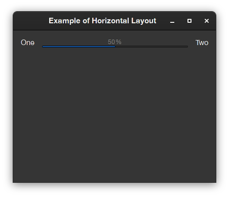

# QA1 - horizontal panel with progress bar taking all the space in the middle 

## Q. 
I want to create a row of three elements a label, a progressbar and a second label.  To do this I've used this code:

```Smalltalk
(SpBoxLayout newLeftToRight
	spacing: 15;
	add: secondsPassed expand: false;
	add: progressBar withConstraints: [ :constraints | 
		constraints
			height: 10;
			fill: false;
			width: 280 ];
	add: timeRemaining expand: false;
	yourself)
```

I've set the width constraint explicitly, but what I'd like to do is have it take up all the space between the two labels no matter how wide the row is.  
So that it's width is flexible and the two labels are fixed.

## A.
 
basically, first and third are to be set as `expand: false` and second one as `expand: true` (which is the default). 
For what you want, this should be enough: 
```Smalltalk
(SpBoxLayout newLeftToRight
	spacing: 15;
	add: secondsPassed expand: false;
	add: progressBar;
	add: timeRemaining expand: false;
	yourself)
```

If you remove the width constraint there that should allow it to expand, since size is not fixed anymore. Also, take into account that in current implementation of `SpBoxLayout`, width and height cannot coexist, since they apply in different layout kinds: 

- `width` applies in horizontal (leftToRight) layouts
- `height` applies in vertical (topToBottom) layouts.

Assuming you have the Gtk backend installed, this code: 
```Smalltalk
presenter := SpPresenter new.
presenter application: (SpApplication new useBackend: #Gtk).

presenter layout: (SpBoxLayout newLeftToRight 
	vAlignStart;
	borderWidth: 15;
	spacing: 15;
	add: (presenter newLabel label: 'One') expand: false;
	add: (presenter newProgressBar fixedAt: 50 percent);
	add: (presenter newLabel label: 'Two') expand: false;
	yourself).
	
presenter openWithSpec title: 'Example of Horizontal Layout'
```

Will produce this output:


