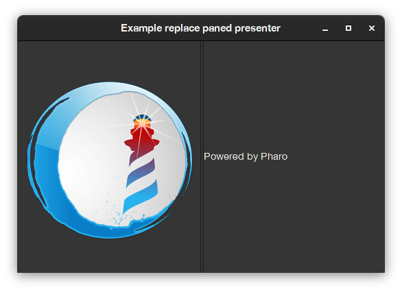

# QA2 - replacing a presenter in a SpPanedLayout

## Q. I want to replace the first presenter in a SpPanedLayout
Is that possible without needed to rebuild the whole presenter? 

I am trying this code, but it does not work correctly: 
```Smalltalk
self layout remove: (self layout children first).
self layout add: aNewPresenter.
```
It actually removes the presenter, but the new presenter is not placed at the first place but at the end.


## A. 
In Spec2, all layouts are dynamic (meaning they can be modified at run time), but each layout has different API and hence they need to be modified in different ways. In particular, `SpPanedLayout` has just two children: **first** and **second** (they can be displayed vertically -top to bottom- or horizontally -left to right-).
This means that unlike `SpBoxLayout`, in `SpPanedLayout` the use of `#add:` and `#remove:` messages are not necesary and will not always produce the desired result, and since `#add:` will try to add the presenter at the end of the list, in case it succeeds it will always be the second. 
Instead, you can just set the children, and you will be effectively replace the presenter at the place you want.

This code: 

```Smalltalk
presenter := SpPresenter new.
presenter application: (SpApplication new useBackend: #Gtk).

presenter layout: (SpPanedLayout newHorizontal
	first: (presenter newLabel label: 'I will replace this');
	second: (presenter newLabel label: 'Powered by Pharo');
	yourself).
	
presenter openWithSpec title: 'Example replace paned presenter'.

presenter layout 
	first: (presenter newImage image: (presenter application iconNamed: #pharoBig)).
```

Will replace the label "I will replace this" with the pharo logo in runtime.


And it will produce this output:


