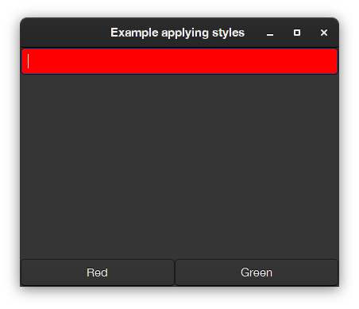
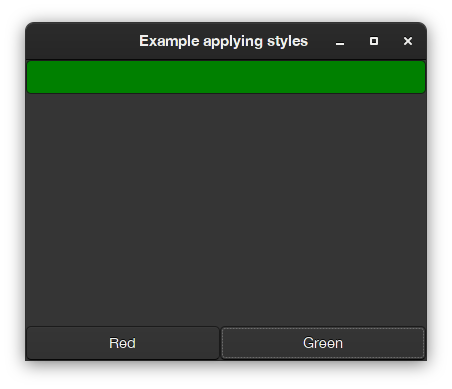

# QA4 - how to change the color (or background color) of a presenter

## Q. I want to change the background color of a SpTextInputFieldPresenter
e.g. to provide a visual feedback of the input, I want to react to `whenTextChangedDo:` and change the background 
color of the field to show if the input is correct or wrong. I know this is not the best for everybody, but I still want to try it. How can I do without hacking?

## A. Spec previews the use of styles to change (up to a point) how a component looks.
Styles are added to an application (an instance of `SpApplication` or child of it) and can be used by any presenter that is part of the application.
Styles can be seen as CSS stylesheets, and in the case of Gtk they actually are CSS stylesheets, but in the case of Morphic backend they have a complete different implementation (you can see all properties you can define in the `SpPropertyStyle` hierarchy.  

The following code will show how to 
- declare styles (in a scripting way, in a production scenario styles would be likely defined in a configuration for the application). 
- use them by adding or removing them.

```Smalltalk
app := SpApplication new.

"If using Morphic"
app addStyleSheetFromString: '.application [
	.red [ Draw { #color: #red } ],
	.green [ Draw { #color: #green } ]	
]'.

"If using GTK (you need to choose one, both options are not possible at the same time)"
app useBackend: #Gtk.
app addCSSProviderFromString: '
.red { background-color: red }
.green { background-color: green }	
'.
 
presenter := SpPresenter new.
presenter application: app.

presenter layout: (SpBoxLayout newTopToBottom
	add: (textPresenter := presenter newTextInput) expand: false;
	addLast: (SpBoxLayout newLeftToRight 
			add: (presenter newButton
				label: 'Red';
				action: [ textPresenter removeStyle: 'green'; addStyle: 'red' ];
				yourself);
			add: (presenter newButton
				label: 'Green';
				action: [ textPresenter removeStyle: 'red'; addStyle: 'green' ];
				yourself);
			yourself)
		expand: false;
	yourself).
	
presenter asWindow 
	title: 'Example applying styles';
	open
```

This will produce (with the Gtk3 backend) this output: 




