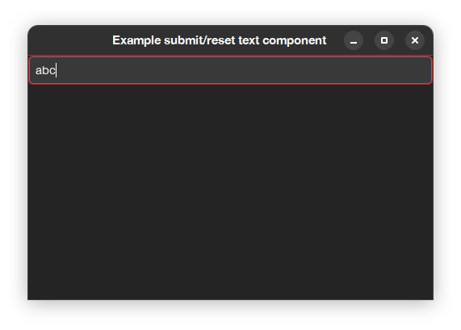

# QA5 - use ctrl-S (or cmd+s) to save text entry

## Q. is there a way in SpTextPresenter and SpTextInputFieldPresenter to use ctrl+S (or cmd+S in mac) to save text entry
Old pharo components (notably old spec but this comes since before, when components when built on plain morphic) were allowing to "accept" contents by pressing `<meta+S>` (and cancelling the edition by using `<meta+L>`). 
Is there a way to replicate this behavior in current Spec. 

## A. Spec permits to define "default" submit/reset events to provide old behavior.
Ok, this is an easy answer, but somehow complicated for some users since they expect the old behavior and this does not works like that anymore.  
So first I need to explain why old behavior is no longer available :)
Thing is, old components where a mix of different things: they were plain UI widgets while also model containers in the spirit of old MVC (Model View Controller). So they mixed Model (the keep of the status) and the view (the display of the component). For this reason, old components had an initial status and you needed to *accept* that status (you got it, using `<meta+S>`) to make it being transferred to the model part.  
This mix of responsibilities lead to different workarounds, like the addition of the `autoAccept` property to make the component copy its value it change of it.  
When designing the new version of Spec we decided to not keep this behavior that looked hacky and was causing inconsistencies in the API and in consequence anyone wanting the old behavior need to make it explicitly in their own components.  

So, how to get old behavior?  
This is the question after all!  
We have added two methods to allow somehow same functionality: `whenSubmitDo:` and `whenResetDo:`. This can be combined with `whenTextChangedDo:` to mark/unmark a dirty property.  
Here is an example, Is a little bit verbose, but is also easy to create your own components with this behavior predefined and reuse them in your application:  

```Smalltalk
app := SpApplication new.

"If using Morphic"
app addStyleSheetFromString: '.application [
	.dirty [ Container { #borderColor: #red, #borderWidth: 1 } ],
	.notDirty [ Container { #borderColor: #transparent, #borderWidth: 1 } ]
]'.

"If using GTK (you need to choose one, both options are not possible at the same time)"
app useBackend: #Gtk.
app addCSSProviderFromString: '
.dirty { 
	border-color: red; 
	border-width: 1px; }
'.
 
presenter := SpPresenter new.
presenter application: app.

presenter layout: (SpBoxLayout newTopToBottom
	add: (textPresenter := presenter newTextInput) expand: false;
	yourself).

text := ''.
textPresenter 
	text: text;
	whenTextChangedDo: [ :aString | 
		aString = text
			ifTrue: [ textPresenter removeStyle: 'dirty'; addStyle: 'notDirty' ]
			ifFalse: [ textPresenter removeStyle: 'notDirty'; addStyle: 'dirty' ] ];
	whenSubmitDo: [ 
		text := textPresenter text.
		('Submitted ', text) crTrace.
		textPresenter 
			removeStyle: 'dirty'; 
			addStyle: 'notDirty' ];
	whenResetDo: [ 
		textPresenter 
			text: text;
			removeStyle: 'dirty';
			addStyle: 'notDirty' ].	

presenter asWindow 
	title: 'Example submit/reset text component';
	open
```

This will produce (with the Gtk3 backend) this output: 



