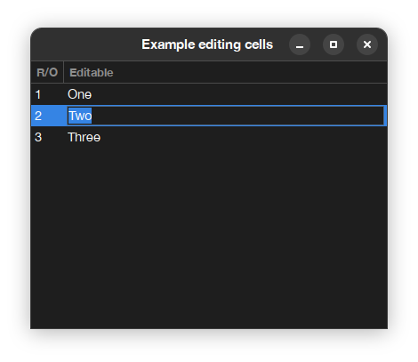

# QA6. How to edit the contents of a table in place 

## Q. I have an `SpTablePresenter` and I would like to edit the cell contents
In many frameworks it is possible to edit the contents of a table directly in place, without needing to open a new component (dialog or master-detail style). How can I do this with Spec ?

## A. Tables and tree tables in Spec inplement a mechanism to edit string columns in place
in Spec, string columns can be edited by just declaring the column to be editable sending the `beEditable` message and adding a callback to process the edition by sending `onAcceptEdition:`, which receives two parameters, the object being editing and the edited string. 

The following code will show how this can be done: 

```Smalltalk
app := SpApplication new.
app useBackend: #Gtk.
 
presenter := SpPresenter new.
presenter application: app.

presenter layout: (SpBoxLayout newTopToBottom
	add: (tablePresenter := presenter newTable);
	yourself).

tablePresenter 
	addColumn: (SpStringTableColumn title: 'R/O' evaluated: #key);
	addColumn: ((SpStringTableColumn 
			title: 'Editable' 
			evaluated: #value)
		beEditable; 
		onAcceptEdition: [ :anAssociation :aString | anAssociation value: aString ];
		yourself).

tablePresenter items: { 1 -> 'One'. 2 -> 'Two'. 3 -> 'Three' }.
	
presenter asWindow 
	title: 'Example editing cells';
	open
```

This will produce (with the Gtk3 backend) this output: 



